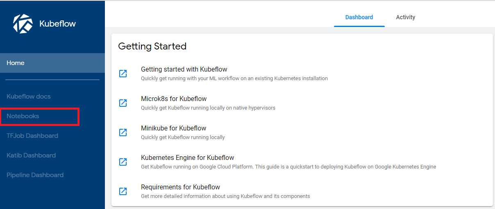
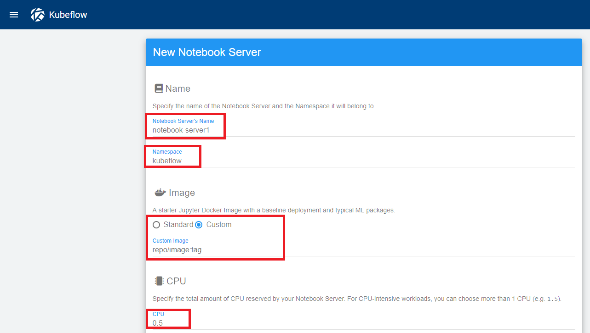
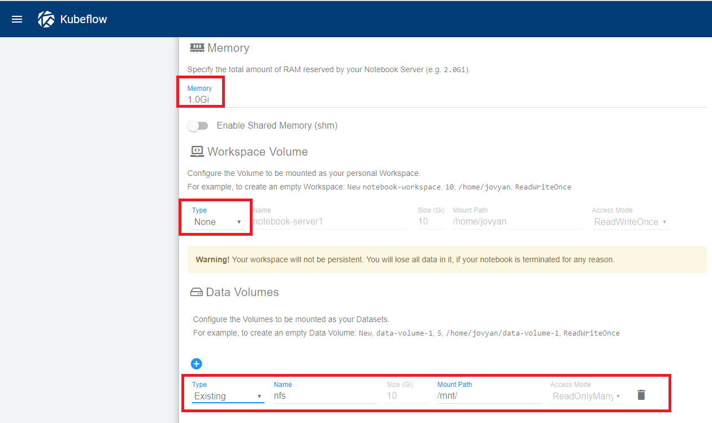
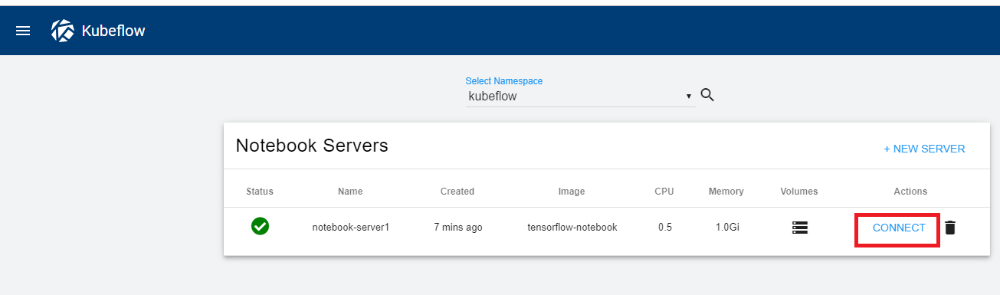
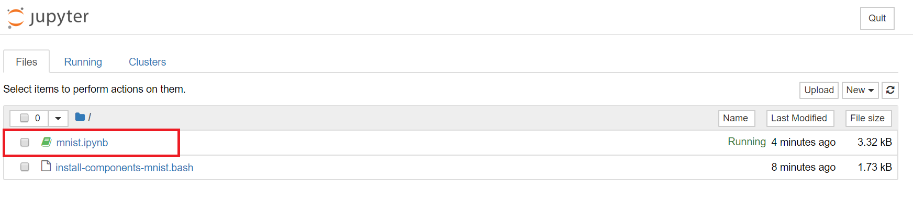
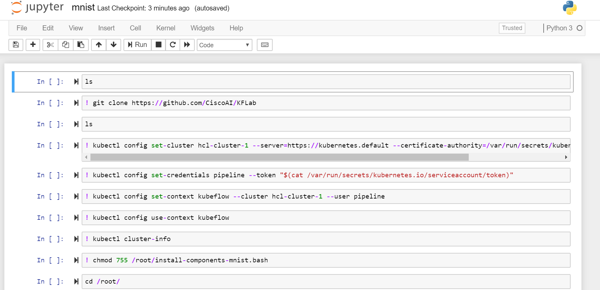

# Run Mnist Kubeflow Pipelines using Jupyter Notebooks
## Infrastructure Used
- Google Kubernetes Engine (Google Cloud Platform)
  
## Setup
To setup the kf-pipeline dashboard using below steps
### Prerequisites
- kubectl
- ksonnet
- nfs-server

## Clone KFLab repo

```
cd ~
git clone https://github.com/CiscoAI/KFLab
cd ~/KFLab/pipelines/tf-mnist
```

## If you are running on Unified Computing System (UCS), create mount paths, and ensure you install and run NFS service

```
# Setup Mounts and directories for Volumes
./setup_volumemounts.sh
```
## If you are running on Google Kubernetes Engine (GKE), run the following command to set up cluster role binding

```
kubectl create clusterrolebinding your-user-cluster-admin-binding --clusterrole=cluster-admin --user=<your@email.com>
```

## If you already have Kubeflow running, selectively run commands from ./setup_pipelines.sh

```
# Setup Kubeflow Pipelines and create k8s resources for running Pipelines
./setup_pipelines.sh
```
If there is any rate limit error from github, please follow the instructions at: [Github Token Setup](https://github.com/ksonnet/ksonnet/blob/master/docs/troubleshooting.md#github-rate-limiting-errors)

Go to http://localhost:8080/pipeline

# Mnist Kubeflow Pipeline through Jupyter Notebook
## Create Cluster Role Bindings
Create Clusterrolebinding for accessing kubernetes cluster through Jupyter Notebook

```
kubectl create clusterrolebinding serviceaccounts-cluster-admin   --clusterrole=cluster-admin   --group=system:serviceaccounts
```

## Docker image for Notebook 
Docker Image URL for Notebook at [docker.io/kraghupathi/tensorflow-notebook:v2](https://hub.docker.com/r/kraghupathi/tensorflow-notebook/tags) 

## Installion of Jupyter Notebook Components
```
git clone https://github.com/kraghupathi/hcl-cisco-project1
git checkout mnist-notebook && cd ~/hcl-cisco-project1/mnist-notebook
./installnotebook.bash
# Ensure that (Notebook controller, Jupyter, Jupyter-webapp and notebook-controller) pods are running in the namespace set in variables.bash. The default namespace is kubeflow
kubectl get pods -n kubeflow
```

## Create Notebook for Mnist
Click Notebooks in the left side of the Kubeflow Dashboard



Click **NEW SERVER** button and provide required details

Provide the custom created Docker Image URL in the Image section (For ex. docker.io/kraghupathi/tensorflow-notebook:v2)



Make Workspace Volume type as **None** and add Data Volume type as existing, name as **nfs** with path as **/mnt/**



Click **SPAWN** button

## Connect to Notebook
Once the Notebook is created click on connect button



Upload the *mnist.ipynb* and *install-components-mnist.bash* files inside the notebook



## Run the Mnist pipelines through Notebook
Open the *mnist.ipynb* file and run step by step.



Once all the commands are executed you can see the running pods in the **kubeflow** namespace.

```
kubectl get pods -n kubeflow
```


