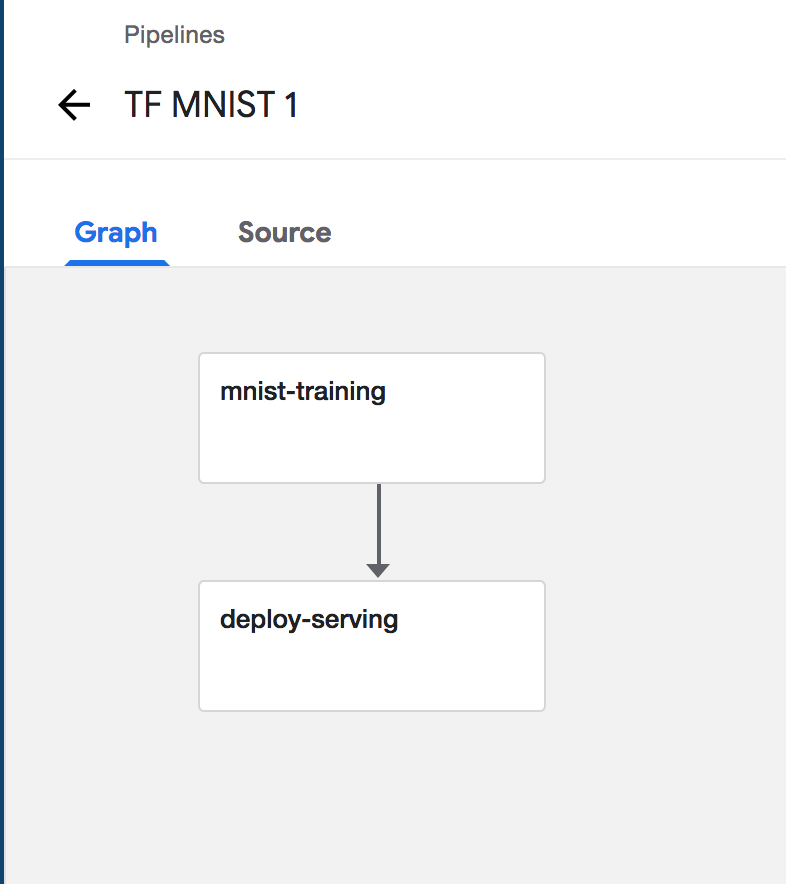

# MNIST Handwritten Digits classifier using Kubeflow Pipelines

Infrastructure Used
-------------------

* Cisco Unified Computing System (On Premise)
* Google Kubernetes Engine (Cloud)

What we're going to build
-------------------------



Setup
-----

### Note

* This set of instructions assumes you already have a k8s cluster up and running.

* Requirements:
 1. kubectl
 2. ksonnet

```bash
git clone https://github.com/CiscoAI/KFLab
cd pipelines/tf-mnist
```

#### If you are running on Unified Computing System (UCS), create mount paths, and ensure you install and run NFS service

```bash
# Setup Mounts and directories for Volumes
./setup_volumemounts.sh
```

```bash
sudo apt install nfs-common
```

Follow this [guide](https://blog.ruanbekker.com/blog/2017/12/09/unmask-a-masked-service-in-systemd/) to unmask this service.

```bash
sudo systemctl start nfs-common
```

#### If you are running on Google Kubernetes Engine (GKE), run the following command to set up cluster role binding

```bash
kubectl create clusterrolebinding your-user-cluster-admin-binding --clusterrole=cluster-admin --user=<your@email.com>
```

#### If you already have Kubeflow running, selectively run commands from `./setup_pipelines.sh`

```bash
# Setup Kubeflow Pipelines and create k8s resources for running Pipelines
./setup_pipelines.sh
```


Go to `localhost:8080/pipeline`

Running the Pipeline
--------------------

Upload the tarball generated by `setup_pipelines.sh` to the Pipelines UI.

### Change the service type to NodePort

After the Pipeline finished, The TF Serving will be created as a service. Change the service type to NodePort, so you can get a prediction from the service, as shown in the following:

```bash
kubectl -n kubeflow patch service mnist -p '{"spec": {"type": "NodePort"}}'
```
